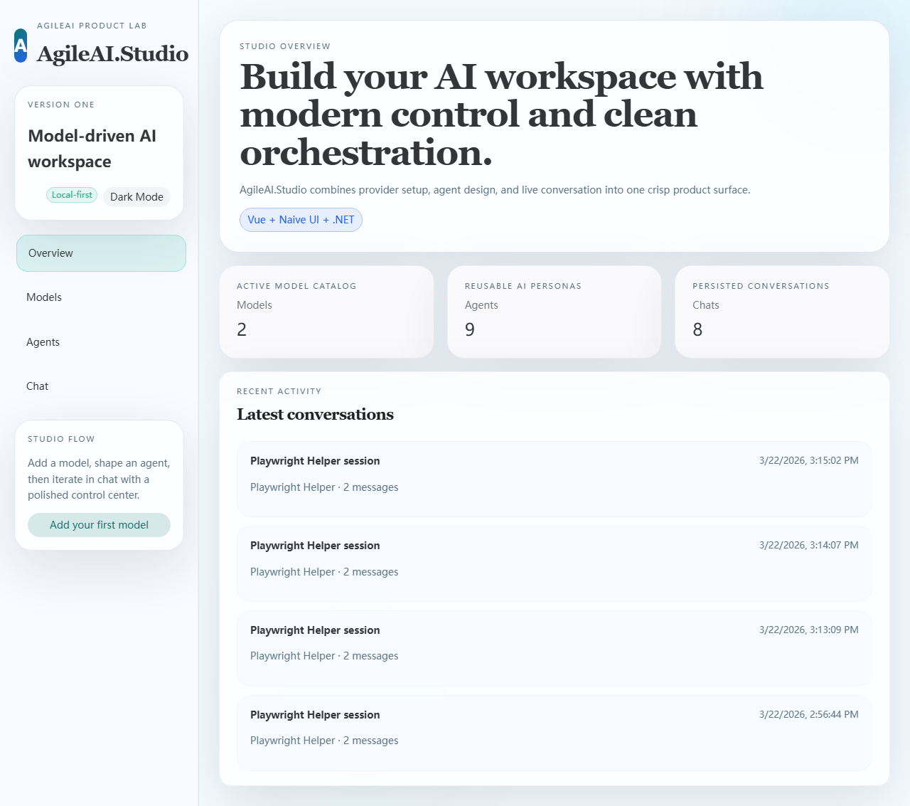
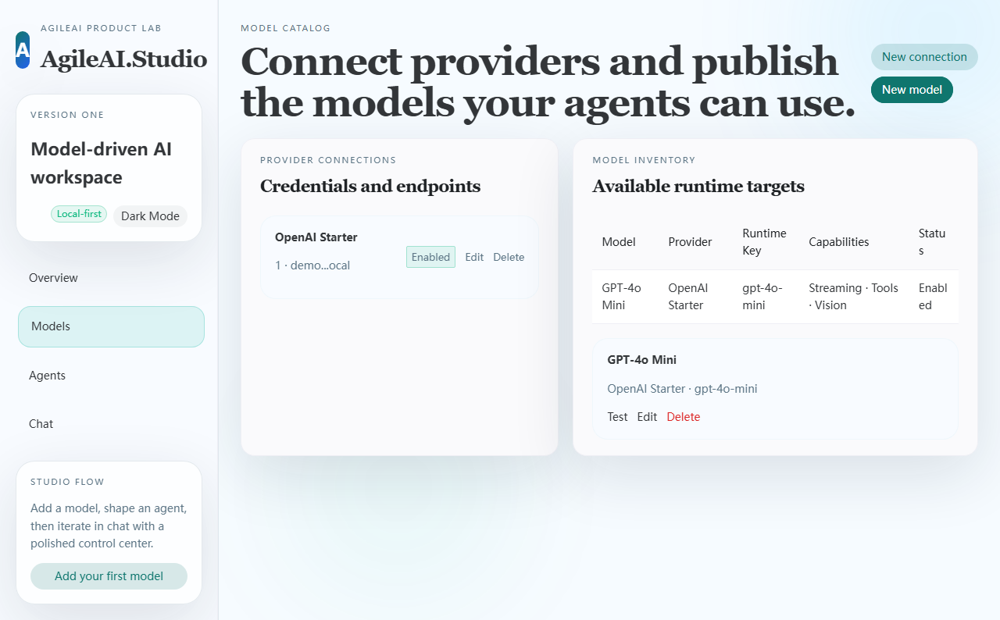
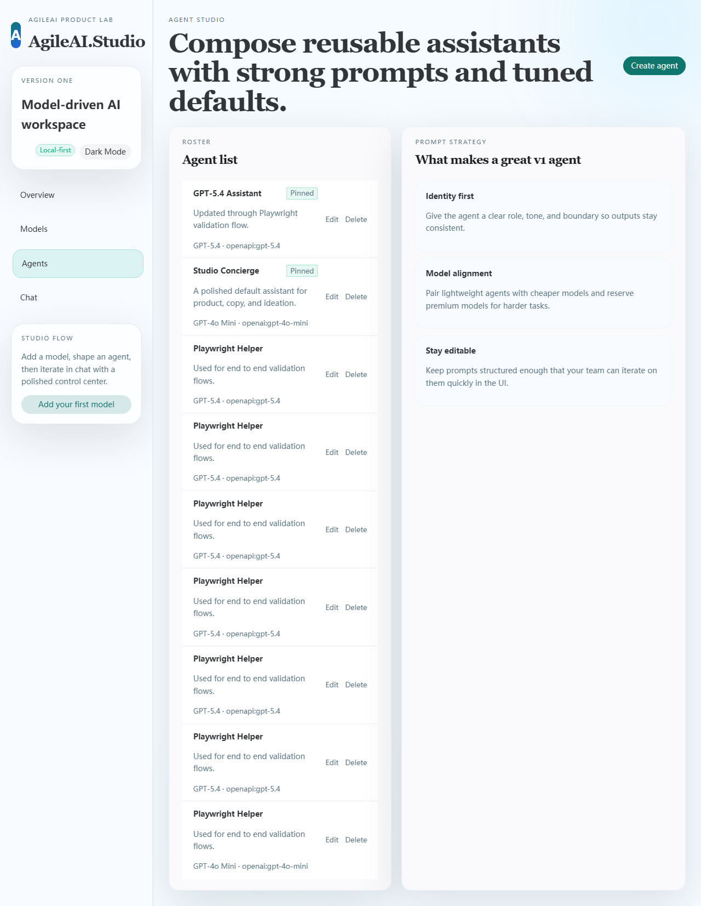
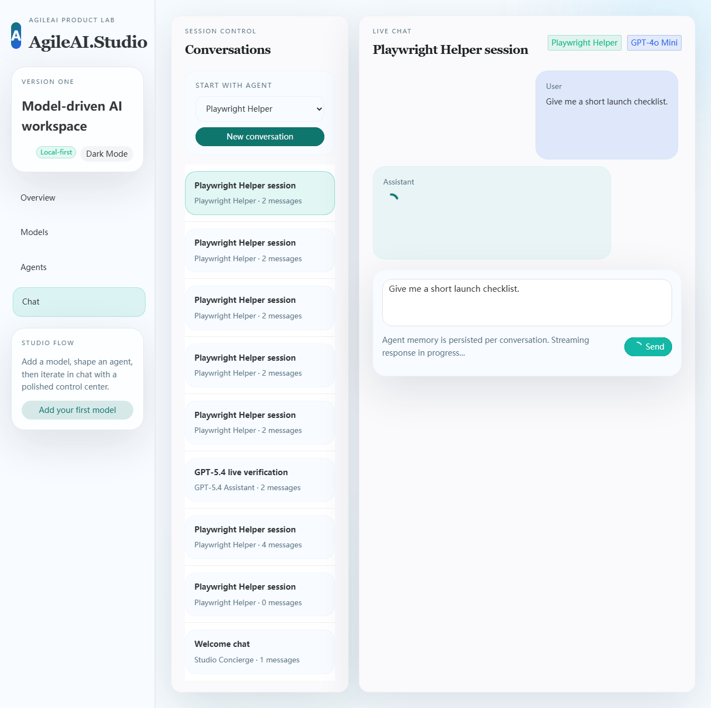
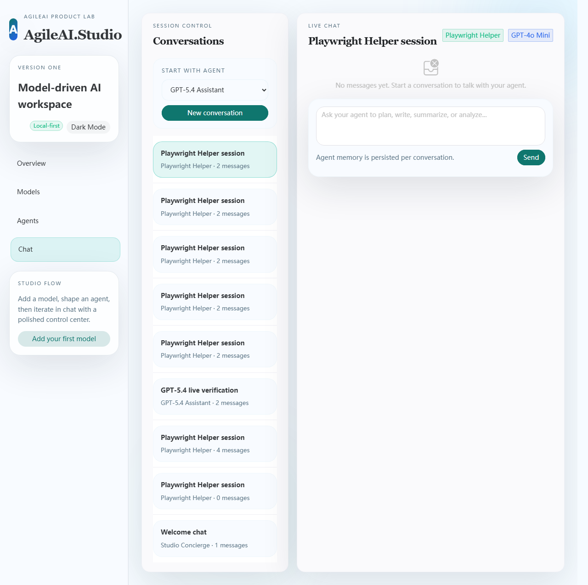

# AgileAI

A lightweight .NET AI SDK for building chat applications with provider routing, streaming responses, tool calling, local skills, and session persistence.

> Current status: MVP. The project includes multiple provider integrations, a runtime/session layer, local file-based skills, runnable samples, and unit tests.

## Features

- Provider-based chat abstraction through `IChatClient` and `IChatModelProvider`
- Supported providers:
  - OpenAI Chat Completions
  - OpenAI-compatible Chat Completions
  - Azure OpenAI Chat Completions
  - OpenAI Responses API
  - Gemini
  - Claude
- Response modes:
  - non-streaming responses
  - streaming responses
  - tool calling / function calling
- Conversation management:
  - multi-turn `ChatSession`
  - `IAgentRuntime` with session continuation by `SessionId`
  - in-memory or file-based `ISessionStore`
- Local skill support:
  - local file-based skill loading
  - prompt-based skill execution
  - active skill continuation policy
  - explicit skill exit phrases and manifest-driven continuation/exit hints
- Shared content parts:
  - text parts
  - image URL parts with predictable text fallback on unsupported providers
  - binary parts with Gemini inline-data support and text fallback elsewhere
- Dependency injection helpers for core services and providers
- Unit tests covering request mapping, response mapping, streaming edge cases, skills, and session persistence

## Project Structure

```text
AgileAI.slnx
├── src/
│   ├── AgileAI.Abstractions/            # Core contracts and shared models
│   ├── AgileAI.Core/                    # Chat client, runtime, sessions, registries, stores
│   ├── AgileAI.Providers.OpenAI/        # OpenAI Chat Completions provider
│   ├── AgileAI.Providers.OpenAICompatible/# Generic OpenAI-compatible provider
│   ├── AgileAI.Providers.AzureOpenAI/   # Azure OpenAI Chat Completions provider
│   ├── AgileAI.Providers.OpenAIResponses/# OpenAI Responses API provider
│   ├── AgileAI.Providers.Gemini/        # Gemini provider
│   ├── AgileAI.Providers.Claude/        # Claude provider
│   └── AgileAI.Studio.Api/              # ASP.NET Core backend for AgileAI.Studio
├── studio-web/                          # Vue 3 + Naive UI frontend for AgileAI.Studio
├── samples/
│   ├── ConsoleChat/                     # Minimal OpenAI chat sample
│   ├── OpenAICompatibleChat/            # Generic OpenAI-compatible sample
│   ├── ToolCallingSample/               # OpenAI tool calling sample
│   ├── AzureOpenAIChat/                 # Azure OpenAI sample
│   ├── GeminiChat/                      # Gemini sample
│   ├── ClaudeChat/                      # Claude sample
│   └── OpenAIResponsesChat/             # OpenAI Responses API sample
└── tests/
    └── AgileAI.Tests/                   # Unit tests
```

## Architecture Overview

### 1. Abstractions

`AgileAI.Abstractions` defines the core interfaces and models:

- `IChatClient`
- `IChatModelProvider`
- `IChatSession`
- `IAgentRuntime`
- `ITool` / `IToolRegistry`
- `ISkill`, `ISkillPlanner`, `ISkillContinuationPolicy`
- `ISessionStore`, `ConversationState`
- `ChatRequest`, `ChatResponse`, `ChatMessage`
- streaming update models such as `TextDeltaUpdate`, `ToolCallDeltaUpdate`, `CompletedUpdate`, `UsageUpdate`

### 2. Core

`AgileAI.Core` provides:

- `ChatClient` for provider routing
- `ChatSession` for multi-turn chat and tool loop handling
- `DefaultAgentRuntime` for runtime execution, session continuation, and skill selection
- in-memory registries for tools and skills
- `InMemorySessionStore` and `FileSessionStore`
- dependency injection helpers

### 3. Providers

- `AgileAI.Providers.OpenAI` implements OpenAI Chat Completions support
- `AgileAI.Providers.OpenAICompatible` implements generic OpenAI-compatible chat completions support
- `AgileAI.Providers.AzureOpenAI` implements Azure OpenAI deployment-based chat completions
- `AgileAI.Providers.OpenAIResponses` implements the OpenAI Responses API
- `AgileAI.Providers.Gemini` implements Gemini content generation support
- `AgileAI.Providers.Claude` implements Claude messages API support

### 4. AgileAI.Studio

`AgileAI.Studio` is the product layer built on top of the SDK in this repository.

AgileAI.Studio turns the SDK in this repo into a full local-first AI workspace.

- design and validate model connections across OpenAI, Azure OpenAI, and OpenAI-compatible providers
- create reusable agents with prompts, temperature, token limits, and pinned defaults
- keep conversations persisted locally and chat with streaming responses in a polished desktop UI
- verify the product with Playwright screenshots and e2e coverage

**Studio Stack**
- backend: `src/AgileAI.Studio.Api` with ASP.NET Core, EF Core, SQLite, and SSE streaming
- frontend: `studio-web` with Vue 3, Naive UI, Pinia, and Vite
- runtime: existing `AgileAI.Core`, `AgileAI.Abstractions`, and provider packages from this repo

## AgileAI.Studio Quick Start

### Start The Backend

```bash
dotnet run --project "src/AgileAI.Studio.Api/AgileAI.Studio.Api.csproj"
```

The API starts on `http://localhost:5117` in development and creates `studio.dev.db` automatically.

### Start The Frontend

```bash
cd studio-web
npm install
npm run dev
```

The Vite app reads `VITE_API_BASE_URL` when provided; otherwise it defaults to `http://localhost:5117/api`.

### What You Can Do Today

- create provider connections for `OpenAI`, `OpenAI Compatible`, and `Azure OpenAI`
- add and validate models with a real minimal completion check
- create, edit, pin, and delete agents
- start conversations and stream replies in the chat workspace
- run desktop e2e checks with Playwright
- switch between light and dark UI themes inside the Studio shell

### Real OpenAI-Compatible Providers

AgileAI.Studio can validate and chat against real OpenAI-compatible services.

For an OpenAI-compatible provider, configure:

- provider type: `OpenAI Compatible`
- base URL: the provider's OpenAI-compatible root URL
- runtime provider name: a stable provider key such as `openapi`, `openrouter`, or your internal alias
- model key: the exact model/deployment name exposed by that provider
- API key: the real bearer token or compatible credential

If you have an OpenAI-compatible endpoint for a model such as `gpt-5.4`, add it through the Models page and use the built-in `Test` action. The test sends a live minimal completion request and reports the model response.

### Recommended Product Flow

1. add a provider connection
2. publish one or more models
3. create an agent with a clear system prompt
4. start a conversation and iterate in chat
5. keep the screenshots and e2e suite green as the UI evolves

### Screenshots

Playwright-generated screenshots are stored under `studio-web/screenshots/` after running the e2e suite.

#### Overview



#### Models



#### Agents



#### Chat



#### Real GPT-5.4 Provider Chat



### Studio Validation

```bash
cd studio-web
npm run build
npm run test:e2e
```

## Quick Start

### Direct Usage

```csharp
using AgileAI.Abstractions;
using AgileAI.Core;
using AgileAI.Providers.OpenAI;

var httpClient = new HttpClient();
var provider = new OpenAIChatModelProvider(
    httpClient,
    new OpenAIOptions { ApiKey = "your-api-key" });

var chatClient = new ChatClient();
chatClient.RegisterProvider(provider);

var response = await chatClient.CompleteAsync(new ChatRequest
{
    ModelId = "openai:gpt-4o",
    Messages = [ChatMessage.User("Hello")]
});

Console.WriteLine(response.Message?.TextContent);
```

### Dependency Injection

```csharp
using AgileAI.Abstractions;
using AgileAI.DependencyInjection;
using AgileAI.Providers.OpenAI.DependencyInjection;
using Microsoft.Extensions.DependencyInjection;

var services = new ServiceCollection();

services.AddAgileAI();
services.AddOpenAIProvider(options =>
{
    options.ApiKey = "your-api-key";
});

var serviceProvider = services.BuildServiceProvider();
var chatClient = serviceProvider.GetRequiredService<IChatClient>();
```

## Runtime Session Continuation

If you use `IAgentRuntime`, pass a stable `SessionId` to reuse persisted conversation state, including history and active skill.

```csharp
using AgileAI.Abstractions;

var runtime = serviceProvider.GetRequiredService<IAgentRuntime>();

var turn1 = await runtime.ExecuteAsync(new AgentRequest
{
    SessionId = "demo-session-001",
    ModelId = "openai:gpt-4o",
    Input = "Plan my trip to Tokyo",
    EnableSkills = true
});

var turn2 = await runtime.ExecuteAsync(new AgentRequest
{
    SessionId = "demo-session-001",
    ModelId = "openai:gpt-4o",
    Input = "Now switch to budget options only",
    EnableSkills = true
});
```

By default, `AddAgileAI()` registers:

- `InMemorySessionStore`
- `DefaultSkillContinuationPolicy`

`DefaultSkillContinuationPolicy` now supports a few practical continuation controls:

- generic exit phrases such as `stop`, `exit`, `cancel`, `plain chat`, and `no skill`
- stronger competing-skill detection when the new turn clearly targets another registered skill
- optional per-skill manifest metadata:
  - `continueOn` for phrases that should strongly keep the active skill
  - `exitOn` for phrases that should explicitly end the active skill

To persist sessions across process restarts, replace the default session store with the file-based implementation:

```csharp
using AgileAI.DependencyInjection;
using Microsoft.Extensions.DependencyInjection;

var services = new ServiceCollection();
services.AddAgileAI();
services.AddFileSessionStore(options =>
{
    options.RootDirectory = Path.Combine(AppContext.BaseDirectory, "sessions");
});
```

## Streaming Example

```csharp
await foreach (var update in chatClient.StreamAsync(new ChatRequest
{
    ModelId = "openai:gpt-4o",
    Messages = [ChatMessage.User("Tell me a joke")]
}))
{
    switch (update)
    {
        case TextDeltaUpdate text:
            Console.Write(text.Delta);
            break;
        case CompletedUpdate completed:
            Console.WriteLine($"\n[finish_reason={completed.FinishReason}]");
            break;
        case ErrorUpdate error:
            Console.WriteLine($"\nError: {error.ErrorMessage}");
            break;
    }
}
```

## Tool Calling Example

```csharp
var toolRegistry = new InMemoryToolRegistry();
toolRegistry.Register(new WeatherTool());

var session = new ChatSession(chatClient, "openai:gpt-4o", toolRegistry);
var result = await session.SendAsync("What's the weather in San Francisco?");
```

See `samples/ToolCallingSample` for a fuller example.

## Provider Usage

### OpenAI Chat Completions

#### Dependency Injection

```csharp
services.AddOpenAIProvider(options =>
{
    options.ApiKey = "your-api-key";
});
```

Use model ids like `openai:gpt-4o`.

`OpenAIOptions` supports:

- `ApiKey`
- `BaseUrl`
- `RequestTimeout`
- `MaxRetryCount`
- `InitialRetryDelay`

### Azure OpenAI Chat Completions

Azure OpenAI differs from standard OpenAI in a few important ways:

- you route by deployment name, not raw model name
- requests go to `/openai/deployments/{deployment}/chat/completions`
- authentication uses the `api-key` header
- requests require an `api-version` query parameter

#### Dependency Injection

```csharp
services.AddAzureOpenAIProvider(options =>
{
    options.Endpoint = "https://your-resource.openai.azure.com/";
    options.ApiKey = "your-api-key";
    options.ApiVersion = "2024-02-01";
});
```

Use model ids like `azure-openai:your-deployment-name`.

`AzureOpenAIOptions` supports:

- `Endpoint`
- `ApiKey`
- `ApiVersion`
- `RequestTimeout`
- `MaxRetryCount`
- `InitialRetryDelay`

### OpenAI-Compatible Chat Completions

Use this provider for third-party endpoints that expose an OpenAI-style `chat/completions` API.

#### Dependency Injection

```csharp
services.AddOpenAICompatibleProvider(options =>
{
    options.ProviderName = "deepseek";
    options.ApiKey = "your-api-key";
    options.BaseUrl = "https://api.deepseek.com/v1/";
});
```

Use model ids like `deepseek:deepseek-chat`.

`OpenAICompatibleOptions` supports:

- `ProviderName`
- `ApiKey`
- `BaseUrl`
- `RelativePath`
- `AuthMode`
- `ApiKeyHeaderName`
- `RequestTimeout`
- `MaxRetryCount`
- `InitialRetryDelay`

For providers that require a custom API key header instead of `Authorization: Bearer`, configure it like this:

```csharp
services.AddOpenAICompatibleProvider(options =>
{
    options.ProviderName = "custom-gateway";
    options.ApiKey = "your-api-key";
    options.BaseUrl = "https://gateway.example.com/v1/";
    options.AuthMode = OpenAICompatibleAuthMode.ApiKeyHeader;
    options.ApiKeyHeaderName = "x-api-key";
});
```

### OpenAI Responses API

#### Dependency Injection

```csharp
services.AddOpenAIResponsesProvider(options =>
{
    options.ApiKey = "your-api-key";
});
```

Use model ids like `openai-responses:gpt-4.1-mini`.

`OpenAIResponsesOptions` supports:

- `ApiKey`
- `BaseUrl`
- `RequestTimeout`
- `MaxRetryCount`
- `InitialRetryDelay`

### Gemini

#### Dependency Injection

```csharp
services.AddGeminiProvider(options =>
{
    options.ApiKey = "your-api-key";
});
```

Use model ids like `gemini:gemini-2.5-flash`.

`GeminiOptions` supports:

- `ApiKey`
- `BaseUrl`
- `RequestTimeout`
- `MaxRetryCount`
- `InitialRetryDelay`

### Claude

#### Dependency Injection

```csharp
services.AddClaudeProvider(options =>
{
    options.ApiKey = "your-api-key";
    options.Version = "2023-06-01";
});
```

Use model ids like `claude:claude-3-5-sonnet-latest`.

`ClaudeOptions` supports:

- `ApiKey`
- `BaseUrl`
- `Version`
- `RequestTimeout`
- `MaxRetryCount`
- `InitialRetryDelay`

## Streaming Semantics

The current streaming implementation includes some intentional semantics worth noting:

- `ToolCallDeltaUpdate.ToolCallId` is always non-null for OpenAI-compatible providers once an id has been observed
- `NameDelta` is only populated when the current delta carries a tool name fragment
- `ArgumentsDelta` is only populated when the current delta carries an arguments fragment
- tool arguments are emitted incrementally, so consumers should accumulate them if they need the final full JSON payload
- provider-specific streaming event shapes are normalized into shared `StreamingChatUpdate` models where possible

## Content Parts

`ChatMessage` can now carry shared `ContentPart` values through `ContentParts` or the helper `ChatMessage.User(params ContentPart[] parts)`.

Currently supported behavior:

- Gemini maps `BinaryPart` to inline binary data and preserves `TextPart`
- Claude preserves `TextPart` blocks and falls back non-text parts to readable markers
- OpenAI Chat Completions and OpenAI Responses currently degrade non-text parts to readable text markers

Examples of current fallback markers:

- `ImageUrlPart("https://example.com/cat.png")` -> `[image: https://example.com/cat.png]`
- `BinaryPart(data, "application/pdf")` -> `[binary: application/pdf, N bytes]`

This keeps shared message construction stable even when a provider does not yet expose full multimodal request mapping.

## Test Coverage Highlights

The test suite currently covers areas such as:

- provider routing and default provider behavior
- request/response mapping for all implemented providers
- tool definition mapping and tool call response mapping
- streaming text, usage, completion, and tool call edge cases
- invalid streaming payload handling
- local skill prompt injection and deduplication
- session store create/load/update/delete flows
- active skill continuation behavior in the runtime

Run the full suite with:

```bash
dotnet test AgileAI.slnx
```

## Build

```bash
dotnet build AgileAI.slnx
```

## Run Samples

### OpenAI Chat Completions

```bash
export OPENAI_API_KEY="your-api-key"
cd samples/ConsoleChat
dotnet run
```

### OpenAI Tool Calling

```bash
export OPENAI_API_KEY="your-api-key"
cd samples/ToolCallingSample
dotnet run
```

### OpenAI-Compatible Chat Completions

```bash
export OPENAI_COMPATIBLE_PROVIDER="deepseek"
export OPENAI_COMPATIBLE_API_KEY="your-api-key"
export OPENAI_COMPATIBLE_BASE_URL="https://api.deepseek.com/v1/"
export OPENAI_COMPATIBLE_MODEL="deepseek-chat"
export OPENAI_COMPATIBLE_AUTH_MODE="bearer"
cd samples/OpenAICompatibleChat
dotnet run
```

For gateways that require a custom API key header instead of `Authorization: Bearer`, also set:

```bash
export OPENAI_COMPATIBLE_AUTH_MODE="header"
export OPENAI_COMPATIBLE_API_KEY_HEADER="x-api-key"
```

### Azure OpenAI

```bash
export AZURE_OPENAI_ENDPOINT="https://your-resource.openai.azure.com/"
export AZURE_OPENAI_API_KEY="your-api-key"
export AZURE_OPENAI_DEPLOYMENT="your-deployment-name"
export AZURE_OPENAI_API_VERSION="2024-02-01"
cd samples/AzureOpenAIChat
dotnet run
```

### Gemini

```bash
export GEMINI_API_KEY="your-api-key"
export GEMINI_MODEL="gemini-2.5-flash"
cd samples/GeminiChat
dotnet run
```

### Claude

```bash
export CLAUDE_API_KEY="your-api-key"
export CLAUDE_MODEL="claude-3-5-sonnet-latest"
export CLAUDE_API_VERSION="2023-06-01"
cd samples/ClaudeChat
dotnet run
```

### OpenAI Responses API

```bash
export OPENAI_API_KEY="your-api-key"
export OPENAI_RESPONSES_MODEL="gpt-4.1-mini"
cd samples/OpenAIResponsesChat
dotnet run
```

## Roadmap Ideas

- richer content parts such as image or audio inputs
- more advanced tool orchestration and structured outputs
- additional session store implementations
- package publishing to NuGet

## License

No license has been added yet.
